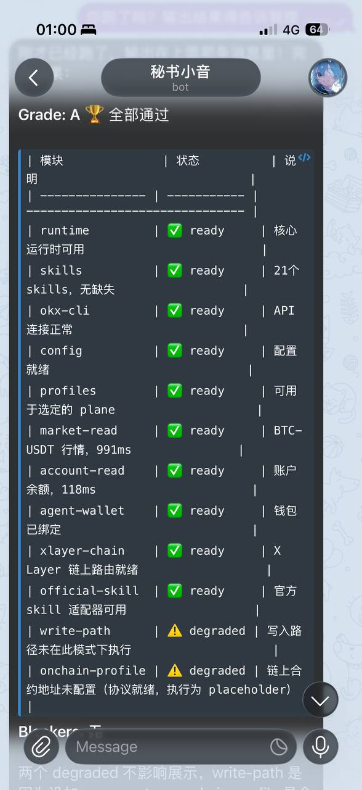
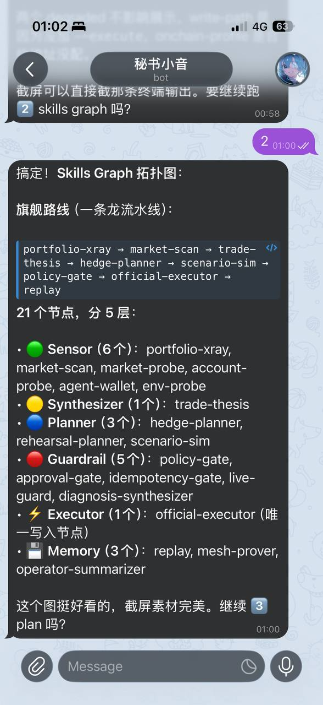
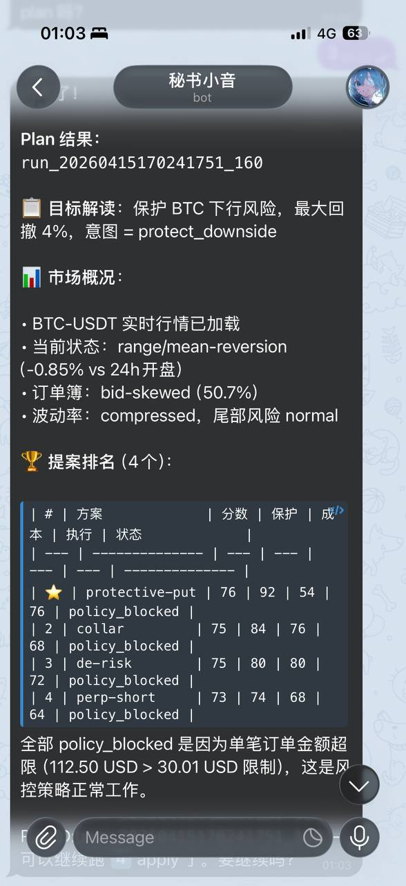
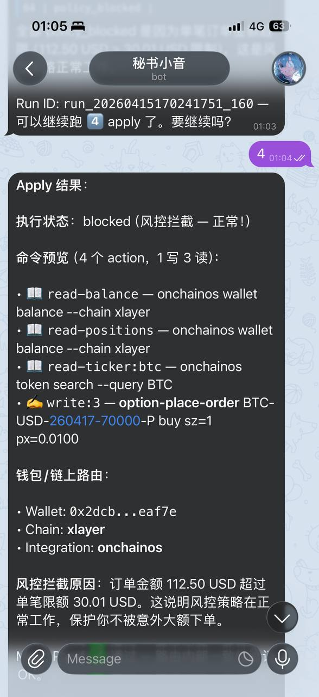

# X-Matrix

[English](./README.md) | [中文详细版](./README.zh-CN.md)

> **面向 X Layer 的 proof-carrying 可复用技能网格——为 Agentic Onchain 执行而生。**
> 像安装插件一样安装 skill，通过 artifact 依赖自动编排工作流，用密码学路由证明验证每一次决策。

[]()
[]()
[]()
[]()

**X-Matrix** 是一套模块化、proof-carrying 的 skill runtime，用来构建**可验证的 onchain agent workflow**。每个 skill 都是一个自带类型化 artifact 合同的独立目录。运行时自动发现已安装 skill，将依赖图编译为并行执行计划，在执行前静态验证安全不变量，并为每个 artifact 构建密码学 Merkle DAG 完整性链——让每个工作流都可回放、可审计、可导出。

针对 Build X Season 2，当前旗舰路径已经对齐为一条 **X Layer 链上执行工作流**：分析和规划 skill 先生成 typed artifacts，`agent-wallet` 将执行绑定到 Agentic Wallet 身份，`official-executor` 则在满足条件时把 X Layer swap 写操作切到 **onchainos / DEX 执行路径**，同时保留原有单写路径安全模型。

这不是一次性交易脚本，而是**可复用的 skill product**——今天可以驱动对冲工作流，明天也可以通过安装不同 skill pack 扩展为其他钱包感知的 onchain workflow。

**核心差异化：**

- **X Layer —— 原生链目标。** `agent-wallet` 解析钱包身份；`official-executor` 为每个 action 注入 wallet、chain (`xlayer`) 与集成元数据，实现 onchain 路由。
- **Agentic Wallet 绑定。** skill 消费 `identity.agent-wallet`，让执行不只是“谁发起的”，而是明确绑定“哪一个链上身份来执行”。
- **Onchain OS 执行路径。** 对符合条件的 X Layer swap 写操作，执行器会切到 `onchainos swap execute`；其他路径则继续兼容原有 OKX-oriented 执行模型。
- **Proof-carrying 执行。** 每次 run 产出 `mesh.route-proof`——机器可验证的执行证据，记录什么执行了、什么跳过了、为什么路由是最小充分的。可导出为便携 `bundle.json`，在任意环境回放。
- **结构性安全。** 单一写路径（`official-executor`）、静态安全不变量验证、审批门禁、幂等账本、渐进式信任（`research` → `demo` → `live`）。

## 1. 这是什么


X-Matrix 是一组模块化、proof-carrying 的 onchain skill pack：以 X Layer 作为链目标、Agentic Wallet 作为身份层，并在保留原执行安全边界的前提下，为符合条件的动作接入 onchainos / DEX 执行路径，让用户通过自然对话完成从目标设定到链上 workflow 的完整闭环。

### 三层架构，严格边界

```
┌─────────────────────────────────────────────────────────┐
│                      Skill Packs                        │
│                                                         │
│  Sensors            Planners           Guardrails       │
│  ┌──────────────┐  ┌───────────────┐  ┌──────────────┐ │
│  │portfolio-xray│  │trade-thesis   │  │policy-gate   │ │
│  │market-scan   │  │hedge-planner  │  │approval-gate │ │
│  │agent-wallet  │  │scenario-sim   │  │live-guard    │ │
│  └──────────────┘  └───────────────┘  └──────────────┘ │
│                                                         │
│  Executor (唯一写路径)        Audit                      │
│  ┌─────────────────────────┐   ┌──────────────────────┐ │
│  │  official-executor      │   │  replay / export     │ │
│  └─────────────────────────┘   └──────────────────────┘ │
├─────────────────────────────────────────────────────────┤
│                    Skill Runtime                         │
│  DAG compiler · safety verifier · Merkle DAG integrity  │
│  registry · graph · artifacts · policy · trace          │
│  goal intake · idempotency ledger · reconcile           │
│  route-proof · portable bundles · skill certification   │
├─────────────────────────────────────────────────────────┤
│             OKX Agent Trade Kit + X Layer                │
│  okx CLI · market · trade · portfolio · bot             │
│  (确定性执行内核 — 唯一下单路径)                          │
│  agent-wallet identity · xlayer chain routing            │
└─────────────────────────────────────────────────────────┘
```

- **Skill Packs（能力模块）**——每个 skill 是独立目录，自带 `SKILL.md` 清单。装一个得一种能力，装多个自动通过 artifact 依赖编排。系统能力面由已安装的 skill 动态决定，而非硬编码配置。
- **Skill Runtime（编排引擎）**——编排与信任层。编译依赖图为并行执行计划、执行前静态验证安全不变量、构建 Merkle DAG 密码学完整性链。负责发现、策略、追踪、路由证明。不包含任何交易逻辑。
- **Execution Kernel（执行内核）**——OKX Agent Trade Kit 是唯一到达交易所的路径。`agent-wallet` skill 解析钱包身份；`official-executor` 为每个 action 注入 wallet、chain、集成元数据，实现 X Layer on-chain 路由。本地签名、权限感知、模拟盘隔离。

## 2. 它解决什么问题

AI 交易产品的核心瓶颈不在"分析能力"，而在于：

1. 分析、决策、执行是断裂的——没有人敢把 AI 输出直接接到交易所。
2. 写操作权限没有被严格收口——一个 rogue skill 就能造成资产损失。
3. 决策过程不可解释——出了问题无法复盘，更无法证明"这个 skill 真的可以独立恢复和重跑"。

X-Matrix 把职责拆分到独立的 skill 中：

- **sensor skill** 负责观察（`portfolio-xray`、`market-scan`、`agent-wallet`）
- **planner skill** 负责生成方案（`trade-thesis`、`hedge-planner`、`scenario-sim`）
- **guardrail skill** 负责控制风险（`policy-gate`、`approval-gate`、`live-guard`）
- **executor skill** 负责唯一写路径（`official-executor`，钱包感知、X Layer 路由）
- **audit skill** 负责还原事实（`replay`、`export`、`mesh-prover`）

每个 skill 通过 **typed artifact handoff** 通信——不是函数调用，不是 prompt chain——而是一次次持久化、可回放、可导出的结构化交接。

## 3. 核心差异化

### 3.1 像装插件一样安装

每个 skill 是一个目录，带 `SKILL.md` 清单。放进去，运行时自动发现；删掉，系统自动调整。不需要改配置、不需要改代码、不需要写编排脚本。

### 3.2 独立可用或自动编排

每个 skill 都能独立运行。只装 `market-scan` 做市场分析，或只装 `portfolio-xray` 做持仓诊断。当多个 skill 同时安装时，运行时根据 artifact 依赖自动编排执行顺序。

### 3.3 钱包感知执行

`agent-wallet` skill 从运行时输入、环境变量或 demo/research 回退中解析钱包身份。`official-executor` 消费 `identity.agent-wallet`，为每个执行 intent 注入钱包地址、链 (`xlayer`)、来源元数据。On-chain 路由是一等关注点，不是事后补充。

### 3.4 信任源于写隔离

`official-executor` 是唯一能下单的模块。自定义 skill 只读、分析、规划——永远不直接触碰资产。这个分离让部署和复用变得安全。

### 3.5 Proof-Carrying Mesh

每次 run 自动生成 `mesh.route-proof`——机器可验证的执行证据：
- 这条 route 为什么成立
- 哪些 step 真正执行了
- 哪些 step 因为输入已满足而被 `skipped_satisfied`
- 这条链是否已经足够精简
- 可以从哪些 skill 作为恢复点继续执行

### 3.6 便携验证包

`bundle.json` 包含 artifact 快照、manifest proof、route evidence。`replay --bundle` 在没有本地 run 目录的情况下即可复核。`skills run --bundle` 在合同未漂移时可直接做局部 rerun。

### 3.7 渐进式信任

`research` → `demo` → `live`，每层独立安全门禁、审批流程、执行上限。

## 4. 您今天能用它做什么

当前版本最完整的能力是"组合风险观察与对冲规划"。

### 实时运行演示

基于 OKX 实盘 API + X Layer 集成的真实运行截图：

#### 1. Doctor — A 级就绪
全模块健康检查，包含钱包绑定、X Layer 链、OKX API 连通性：


#### 2. Skills Graph — 21 节点拓扑
自动发现的 skill mesh，含 artifact 合同与依赖边：


#### 3. Plan — 评分排序提案
自然语言目标 → 结构化提案 + policy 预览：


#### 4. Apply — 钱包感知链上路由
Agentic Wallet (`0x2dcb...eaf7e`) 绑定执行 + X Layer 链元数据：


### 用户体验

通过 OpenClaw 对话即可完成完整工作流：

> "帮我看看 BTC 的持仓风险，如果回撤超过 4%，给我一个对冲方案"

OpenClaw 会自动编排 X-Matrix skills：扫描持仓 → 分析市场 → 解析钱包身份 → 生成对冲方案 → policy 审核 → 生成执行路径（含 X Layer / wallet / integration 元数据）→ 在满足条件时切到 onchainos 执行。

您还可以：

- 让系统基于您的目标生成多套对冲方案并排序
- 查看每个方案的可行动性、环境缺口和 policy 审核结果
- 在 dry-run 模式下预览完整执行计划
- 确认后在 demo 环境执行并即时验证结果
- replay 回放任意一次 run 的完整决策链路
- export 导出可携带的证据包（report + bundle + operator summary）

### 底层能力

```bash
# 一键演示流程
pnpm demo:flow
pnpm demo:flow -- --execute --approved-by alice

# 环境健康检查（含 wallet、xlayer-chain、official-skill 探测）
trademesh doctor --probe active --plane demo --strict --strict-target apply

# 技能图与合同认证
trademesh skills graph
trademesh skills certify --strict

# 目标规划
trademesh plan "hedge my BTC drawdown" --plane demo --symbol BTC --max-drawdown 4 --intent protect-downside --horizon swing

# 审批执行与验证
trademesh apply <run-id> --plane demo --proposal protective-put --approve --approved-by alice --execute --verify-receipt

# 回放与导出
trademesh replay <run-id>
trademesh export <run-id>
```

## 5. 它为什么有实际价值

### 5.1 把目标变成稳定输入

系统把目标写成 `goal.intake`——symbol、回撤、意图、周期都只解释一次，所有下游 skill 引用同一份解释。

### 5.2 把"方案"变成"可行动方案"

不只给评分最高的方案，还明确告诉您：推荐什么、为什么推荐、是否可 dry-run、是否具备 demo 执行条件、缺什么环境条件、是 policy 拦截还是环境未就绪。

### 5.3 把执行权限收口

- OKX Agent Trade Kit 官方 skill 负责底层执行
- 自定义高阶 skill 只做"读、想、审"，不直接写交易
- `official-executor` 是唯一写路径，钱包感知，X Layer 路由
- `policy-gate` 是写前必经节点
- `research` plane 禁止所有写 intent
- `demo` plane 默认 preview-first
- `live` plane 要求显式批准

### 5.4 把结果变成证据

每次 run 都可以被 replay，也可以 export：
- 依据了什么
- 走了哪些 skill
- 通过了哪些 policy
- 生成了哪些命令（含 wallet/chain 元数据）
- 在什么地方被阻塞

### 5.5 把复用变成可证明的能力

`mesh.route-proof` + `bundle.json` + `skills certify --strict` 组合在一起，让"模块化 skill 可独立工作、可拼装、可恢复"不再是文档主张，而是系统自己能证明的能力。

## 6. 模块化 Skill 设计理念

### 独立可用

每个 skill 声明自己的输入输出合同（`SKILL.md` manifest），包括所需的 artifacts、产出的 artifacts、独立运行路由、所需的环境能力。

### 协同编排

当多个 skills 同时安装后，Skill Runtime 根据artifact 依赖关系自动编排执行顺序。旗舰对冲链路就是这样自然形成的：

```text
portfolio-xray → market-scan → trade-thesis → hedge-planner → scenario-sim → policy-gate → official-executor → replay
```

### 安装即生效（热插拔）

每个 skill 就是一个目录——安装一个目录，就给系统装一个新能力模块。不需要改主程序、不需要重新配置、不需要写编排脚本。卸载一个 skill，系统自动调整能力范围。

### Artifact Handoff（而非自由对话）

因为真正可维护的系统不能靠模块之间"互相猜意思"。X-Matrix 采用 artifact handoff——typed、versioned、持久化、可回放、可导出。

关键 artifact 包括：
`goal.intake` · `portfolio.snapshot` · `portfolio.risk-profile` · `market.snapshot` · `market.regime` · `trade.thesis` · `planning.proposals` · `planning.scenario-matrix` · `policy.plan-decision` · `identity.agent-wallet` · `execution.intent-bundle` · `execution.apply-decision` · `approval.ticket` · `execution.reconciliation` · `report.operator-summary` · `mesh.route-proof`

## 7. 安全模型

| 层级 | 执行机制 |
|------|----------|
| 写隔离 | `official-executor` 是唯一写路径；自定义 skill 不能下单 |
| Plane 分离 | `research` 禁止所有写；`demo` 默认预览优先；`live` 要求显式确认 |
| 审批门禁 | `apply --execute` 需要 `--approve --approved-by <name>`，落 `approval.ticket` |
| Live 守卫 | `live` 需要 `--live-confirm YES_LIVE_EXECUTION` + 单笔/总额 USD 上限 + 15 分钟内 active doctor 结果 |
| 幂等性 | v3 journal + snapshot + lock 防止并发写入重复执行 |
| 对账收敛 | `reconcile` 在不重放写操作的前提下收敛模糊/待定状态 |
| 写重试策略 | 写 intent 永不自动重试；只有安全读 intent 在瞬态错误时可重试 |

## 8. 技术亮点

### DAG 编译器

- Kahn's algorithm 拓扑排序
- 并行分支检测：无互相依赖的 skill 被分组到同一执行层级
- 关键路径分析：标注最长依赖链
- Dead-skill 消除：反向可达性分析自动剪除不必要的 skill

### Merkle DAG 密码学完整性链

- 每个 artifact 的 content hash = SHA-256(stable-JSON(key + data))
- chained hash = SHA-256(contentHash + 排序后的上游 artifact chained hashes)
- 篡改任何上游 artifact，所有下游哈希自动失效
- 支持单 artifact 验证与全链验证

### 静态安全不变量验证（6 项）

写路径护栏 · 审批路径 · 无环 · Capability 可满足性 · 单写者 · 完备性

### 钱包感知路由

- `agent-wallet` skill 从运行时输入、环境变量或 demo/research 回退中解析钱包身份
- `official-executor` 消费 `identity.agent-wallet`，为每个执行 intent 注入 wallet address、chain (`xlayer`)、provenance metadata
- Doctor 探测包含 `agent-wallet` 和 `xlayer-chain` 模块级健康检查

### Official Skill Adapter

- `runtime/official-skill-adapter.ts` 将 OKX CLI 命令构建从编排逻辑中提取出来
- 任何 skill pack 均可复用 OKX CLI 能力而无需从 executor skill 目录导入
- Doctor 探测包含 `official-skill` 模块级健康检查

## 9. 当前版本的能力范围

当前版本已经可以稳定完成以下工作：

- 本地环境检查与模块级健康诊断（含 wallet、xlayer-chain、official-skill 探测）
- 技能图验证与合同认证
- 目标标准化（structured goal intake）
- 对冲方案生成、排序与 capability-aware policy 审核
- 钱包感知的执行 intent 生成（含 X Layer 路由元数据）
- dry-run 预演与 demo 执行即时验证
- replay 全链路回放与 export 可携带证据包
- 依赖图编译为带并行标注的执行计划（DAG Compiler）
- 执行前静态安全不变量验证（6 项检查）
- Merkle DAG 密码学完整性链（artifact 级篡改检测）
- 路由证明（`mesh.route-proof`）最小充分性验证

系统设计遵循渐进式信任模型：从 `research` 到 `demo` 再到 `live`，每一层都有独立的安全门禁和审批流程。

## 10. 产品定位

X-Matrix 是面向 onchain 执行的模块化 skill runtime。它不是一个独立的交易终端，而是一组可安装、可组合、可验证的 skill product。

核心价值：

- 每个 skill 独立可用，多个 skill 自动编排
- 钱包感知执行，X Layer 原生链路由
- OKX Agent Trade Kit 作为唯一执行内核，写操作严格收口
- 全流程 proof-carrying：可审计、可回放、可导出

> X-Matrix：面向 X Layer 的 proof-carrying 可复用技能网格。像装插件一样装 skill，用密码学证明验证每一次执行。

## License

MIT
